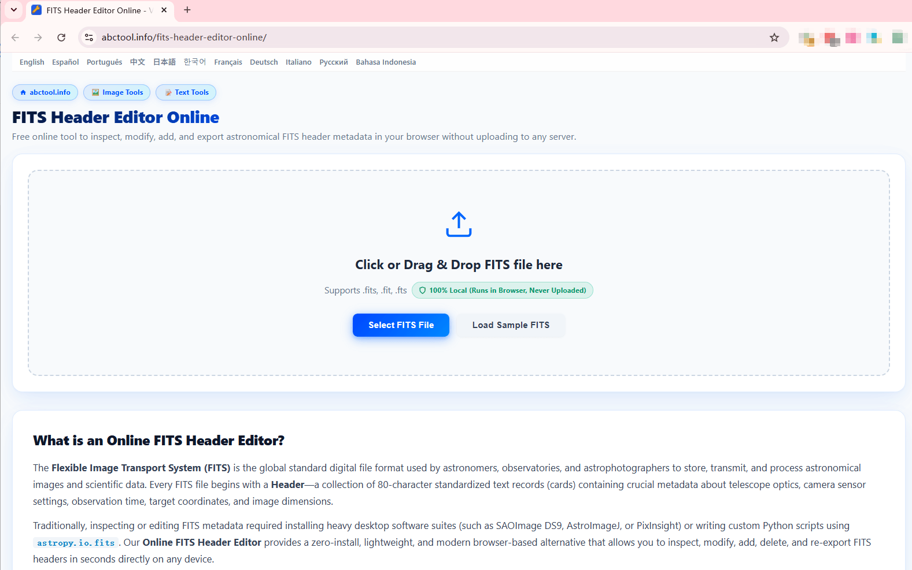
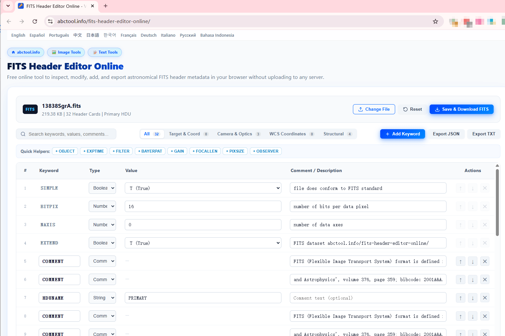

# FITS Header Editor

> 天文学の **FITS**（`.fits`, `.fit`, `.fts`）ヘッダーメタデータを、ブラウザ上で高速かつ安全に確認・編集・追加・エクスポートできるオンラインツールです（クライアント側で完全動作）。
>
> 🔗 **オンラインツール**: [https://abctool.info/fits-header-editor-online/ja/](https://abctool.info/fits-header-editor-online/ja/)
>
> 🌐 [English](README.md) | [Español](README.es.md) | [中文](README.zh.md) | **日本語**

---

## 概要

従来、天文学の FITS ヘッダーメタデータを閲覧・編集するには、重いデスクトップ専用ソフトウェア（SAOImage DS9、AstroImageJ、PixInsight など）をインストールするか、Python の `astropy.io.fits` スクリプトを実行する必要がありました。

**[FITS Header Editor Online](https://abctool.info/fits-header-editor-online/ja/)** は、ブラウザ上だけで完結する FITS ヘッダーの閲覧・編集環境を提供します：
- **100% クライアント側動作・高いプライバシー性**：ファイル解析や処理はすべてブラウザ内部で実行されます。天体画像データが外部サーバーにアップロードされることは一切ありません。
- **インストール不要**：モダンブラウザを搭載したあらゆるデバイス（Windows、macOS、Linux、タブレット）ですぐに使用できます。
- **リアルタイム編集**：80 文字の標準 FITS カードをリアルタイムで追加・変更・並べ替え・削除可能。
- **多彩なエクスポート**：編集後の `.fits` ファイルをそのまま保存・ダウンロードできるほか、メタデータを JSON や TXT 形式で書き出すことも可能です。

---

## 使い方

### 1. FITS ファイルの読み込み

[FITS Header Editor Online](https://abctool.info/fits-header-editor-online/ja/) を開くと、ファイル読み込み画面が表示されます：

- **ファイルの選択またはドラッグ＆ドロップ**：`.fits`、`.fit`、`.fts` ファイルを点線枠内にドラッグ＆ドロップするか、**Select FITS File** ボタンをクリックして選択します。
- **サンプルファイルの読み込み**：機能をすぐに試したい場合は、**Load Sample FITS** をクリックすると、あらかじめ用意されたサンプル天体データ（`13838SgrA.fits`）がワンクリックで読み込まれます。

---

### 2. メタデータの確認と検索

ファイルを読み込むと、インタラクティブなヘッダー編集テーブルが表示されます：

- **ファイル概要情報**：上部バーにファイル名、ファイルサイズ、ヘッダーカード総数、HDU 種別（例: `Primary HDU`）が表示されます。
- **リアルタイム検索**：検索ボックス（`Search keywords, values, comments...`）でキーワード名、値、コメントを素早く絞り込めます。
- **カテゴリフィルター**：標準的な機能別カテゴリでカードを絞り込み表示できます：
  - **All**：すべてのカードを順番通りに表示。
  - **Target & Coord**：対象天体名、赤経・赤緯（RA/DEC）座標、元期（Equinox）など。
  - **Camera & Optics**：露出時間、ゲイン、フィルター名、焦点距離、ピクセルサイズなど。
  - **WCS Coordinates**：天体測定投影標準パラメータ（CRVAL、CRPIX、CD 行列など）。
  - **Structural**：FITS 構造定義カード（SIMPLE、BITPIX、NAXIS、EXTEND など）。

---

### 3. キーワードの編集・追加・整理

編集テーブルでは各カードを細かく管理できます：

- **値と型の編集**：インラインで直接変更できます。ブール値は便利なドロップダウン切り替え（`T (True)` / `F (False)`）に対応し、文字列や数値も直接入力可能です。
- **クイックヘルパー（Quick Helpers）**：よく使われる天文学パラメータのボタンをクリックするだけで、標準キーワードをワンクリックで追加できます：
  - `+ OBJECT`（対象天体名）
  - `+ EXPTIME`（露出時間 / 秒）
  - `+ FILTER`（光学フィルター名）
  - `+ BAYERPAT`（ベイヤー配列パターン）
  - `+ GAIN`（センサーゲイン）
  - `+ FOCALLEN`（望遠鏡の焦点距離）
  - `+ PIXSIZE`（ピクセルの物理サイズ）
  - `+ OBSERVER`（観測者・撮影者名）
- **カスタムキーワードの追加**：**+ Add Keyword** をクリックして、任意のキーワード名、型、値、コメントを持つカスタムカードを作成できます。
- **並べ替えと削除**：右側の上下矢印（`↑`、`↓`）でカードの順序を変更し、（`✕`）をクリックして不要なカードを削除できます。
- **リセット**：右上の **Reset** をクリックすると、未保存の変更を破棄して元の状態に戻せます。

---

### 4. 保存とエクスポート

編集が完了したら：
- **Save & Download FITS**：更新されたヘッダーと元の画像バイナリデータを統合し、規約に準拠した `.fits` ファイルとして端末にダウンロードします。
- **Export JSON**：すべてのヘッダーカードを構造化された JSON 形式で出力。スクリプト処理や自動化に便利です。
- **Export TXT**：FITS ヘッダーカードの標準プレーンテキスト形式で書き出します。

---

## 対応フォーマットと互換性

| 項目 | 詳細 |
| :--- | :--- |
| **対応ファイル拡張子** | `.fits`, `.fit`, `.fts` |
| **HDU サポート** | Primary HDU および標準イメージ拡張 |
| **標準準拠** | NASA / IAU 標準の 80 カラム FITS カード形式に完全準拠 |
| **セキュリティ・プライバシー** | 100% ブラウザ内実行（WebAssembly / JavaScript）。クラウドへのアップロードなし |

---

## オンラインツールへのアクセス

👉 ブラウザですぐに利用可能：**[https://abctool.info/fits-header-editor-online/ja/](https://abctool.info/fits-header-editor-online/ja/)**
